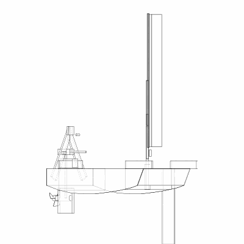
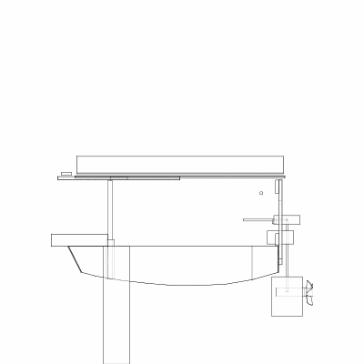

# DuckWing

A project to design a wing sail for a Puddle Duck Racer.
Ideally the wing sail should support solar panels that enable an electric
motor to power the puddle duck when the wind is down.

## Tacking

The idea here is that tacking works a bit like an airplane wing flying back
and forth, not like a regular fabric sail at all.

## Hoisting

The idea here is that raising the sail works in two stages: 
first turning it from a cockpit roof into something like an airplane wing,
then second, rotating it so the aerofoil lift pulls the boat.

